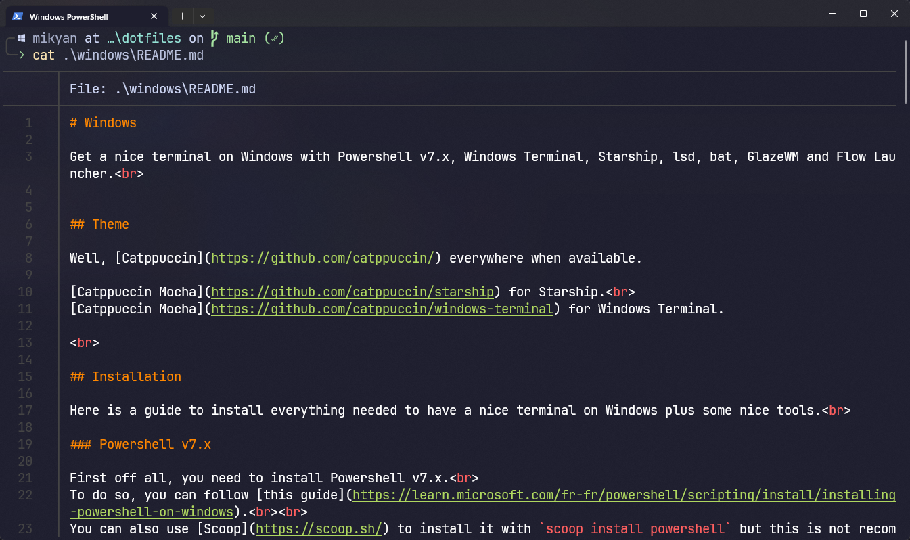

# Windows

<div align=center>

</div>

## Theme

Well, [Catppuccin](https://github.com/catppuccin/) everywhere when available.

[Catppuccin Mocha](https://github.com/catppuccin/starship) for Starship.<br>
[Catppuccin Mocha](https://github.com/catppuccin/windows-terminal) for Windows Terminal.

<br>

## Installation

Here is a guide to install everything needed to have a nice terminal on Windows plus some nice tools.<br>

### Powershell v7.x

First off all, you need to install Powershell v7.x.<br>
To do so, you can follow [this guide](https://learn.microsoft.com/fr-fr/powershell/scripting/install/installing-powershell-on-windows).<br><br>
You can also use [Scoop](https://scoop.sh/) to install it with `scoop install powershell` but this is not recommended.<br>
If you already have Powershell v7.x installed, you can skip this step.

<br>

### Scoop

You can use [Scoop](https://scoop.sh/) to install and manage all the packages needed.<br>
If you already have Scoop installed, you can skip this step.
<br><br>
Any other package manager should work too.<br>

To install Scoop, open Powershell and run the following command:
```powershell
Set-ExecutionPolicy RemoteSigned -Scope CurrentUser # Optional: Needed to run a remote script the first time
irm get.scoop.sh | iex
```

Add the Scoop bucket `extras` with:
```powershell
scoop bucket add extras
```

<br>

### Nerd Front

Download and install a nerd font of your choice at: https://www.nerdfonts.com/font-downloads<br>
I'm using Fira Code and JetBrains.

<br>

### Change Windows Terminal Font

1. Open Windows Terminal
2. Open Settings (Ctrl + ,)
3. Go to `Default` tab
4. Go to `Appearance` tab
5. Change `Font Face` to your nerd font

<br>

### Change Windows Terminal Theme

1. Open Windows Terminal
2. Open Settings (Ctrl + ,)
3. Click on `Open JSON file` at the bottom of the window			
4. Add the following lines to the `schemes` array:
```json
{
  "name": "Catppuccin Mocha",

  "cursorColor": "#F5E0DC",
  "selectionBackground": "#585B70",

  "background": "#1E1E2E",
  "foreground": "#CDD6F4",

  "black": "#45475A",
  "red": "#F38BA8",
  "green": "#A6E3A1",
  "yellow": "#F9E2AF",
  "blue": "#89B4FA",
  "purple": "#F5C2E7",
  "cyan": "#94E2D5",
  "white": "#BAC2DE",

  "brightBlack": "#585B70",
  "brightRed": "#F38BA8",
  "brightGreen": "#A6E3A1",
  "brightYellow": "#F9E2AF",
  "brightBlue": "#89B4FA",
  "brightPurple": "#F5C2E7",
  "brightCyan": "#94E2D5",
  "brightWhite": "#A6ADC8"
}
```
5. Go to `Default` tab
6. Go to `Appearance` tab
7. Change `Color Scheme` to `Catppuccino Mocha`

<br>

### Install Starship

1. Open Powershell
2. Install Starship with Scoop: `scoop install starship`
3. Create a `Microsoft.PowerShell_profile.ps1` file in `C:\Users\<username>\Documents\PowerShell\` or open it with `code $PROFILE`
4. Add the following lines to the file:
```powershell
Invoke-Expression (&starship init powershell)
```
5. Copy the content of `starship.toml` from this repo to `C:\Users\<username>\.config\starship.toml`
6. Change the name of the user in the file to your username.

<br>

### Install lsd

1. Open Powershell
2. Install lsd with Scoop: `scoop install lsd`	
3. Open your Powershell profile with `code $PROFILE`.
4. Add the following lines to the file:
```powershell
function RunLsd($args)
{
    lsd --header --color=always --group-directories-first $args
}

Set-Alias -Name ls -Value RunLsd -Option AllScope -Force
```

<br>

### Install bat

1. Open Powershell
2. Install bat with Scoop: `scoop install bat`
3. Open your Powershell profile with `code $PROFILE`.
4. Add the following lines to the file:
```powershell
function RunBat($args)
{
    bat --style=grid --color=always $args
}

Set-Alias -Name cat -Value RunBat -Option AllScope -Force
```

<br>

### Install GlazeWM

1. Open Powershell
2. Install GlazeWM with Scoop: `scoop install glazewm`
3. Create a `glazewm.yaml` file in `C:\Users\<username>\.config\`
4. Copy the content of `glazewm.yaml` from this repo to the file
5. Open your Powershell profile with `code $PROFILE`.
6. Add the following lines to the file:
```powershell
function RunGlaze($args)
{
    Process-Start 'glazewm' -WindowStyle Hidden
}

Set-Alias -Name wm -Value RunGlaze -Option AllScope -Force
```

<br>

### Install Flow Launcher

1. Open Powershell
2. Install Flow Launcher with Scoop: `scoop install flow-launcher` or download it from [here](https://flow-launcher.github.io)
3. Open Flow Launcher
4. Go to `Settings`
5. Go to `General`
6. Check `Start Flow Launcher on system startup`
7. Configure whatever you want

<br>

### Install gitui

1. Open Powershell
1. Install gitui with Scoop: `scoop install gitui`

<br>

## Commands

Some aliases and keybinds are available by default.<br>

| Command         	| Description              	|
|-----------------	|--------------------------	|
| `wm`            	| Start glazewm (Terminal) 	|
| Alt + Shift + R 	| Reload glazewm config    	|
| Alt + Shift + E 	| Stop glazewm             	|

Check `glazewm.yaml` for all available keybinds.
